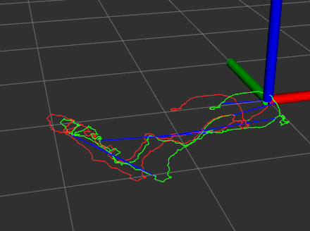

#### 项目介绍
学习了slam的知识也算比较多，比较杂了，准备借着这个项目把所学的东西串起来。虽然一瞬间感觉slam系统哪个部分都已经会了，但是我相信写起代码来还是会遇到很多问题的。这个项目，我大概涉及几个部分的知识
* VO前端
* 后端优化
* cmake/make

我打算从0开始写一个slam系统，这个系统不要求有多高的精度，只求能够把流程跑一遍。程序的结构上，前端和后端分开设计，做成可替换的模块。cmake/make主要是顺便学习一下怎么组织一个看起来比较高级的项目。

一些细节交代：
* 开发环境:ubuntu18.04+ros melodic
* 数据集:rgbd_dataset_freiburg2_pioneer_360

日期：2021/1/22 13:58

> 这个项目可能会烂尾，毕竟是我嘛，hhh。

---

##### 更新

开发的过程中遇到了很多的bug，整个项目的方案也是改了又改，最后形成的方案如下：

* VO前端采用的是frame-to-frame的最简单的方式。
* 后端采用的是非实时的，即前端计算完成后再调用后端来优化。
* 关键帧的选取为固定间隔
* 可视化的模块采用rviz，所以必须和ros一起编译

* 数据集也改了，旧的数据集VO前端不能很好的工作，最后换成了[rgbd_dataset_freiburg1_desk](https://vision.in.tum.de/data/datasets/rgbd-dataset/download#freiburg1_desk)，这个东西VO前端工作的比较正常。

* 回环的选取，确实是使用了dbow，但是并不能够选取出足够多的信息，导致优化前后效果差不多，由于数据集比较小，所以暴力穷举了所有关键帧，通过重投影误差来判断效果。
* 优化方面采用的是g2o，方式是位姿图，比较懒得去求导（当然也可能是不会，我没去仔细思考），直接用默认的数值求导的方法。

日期：2021/2/18 18：05

> 这个项目可能看起来很简单，但是也算是完整的走了一套slam的流程，当然好像和一开始立下的flag差了点东西，cmakelists并没有写的很高端，只是最简单的把项目组织起来而已，并没有那些大型项目一样各种判断和检查，我也没有很搞清楚cmake的具体写法，里面的东西都是以往的经验和一些项目东拼西凑起来的。

### 项目介绍

* `config.h`和`config.cpp`其实就是一个读配置的通用文件，采用单例的设计模式。
* `camera.h`相机模型。
* `frame.h`和`frame.cpp` 主要负责记录一些数据，包括color和depth以及特征匹配的一些信息。
* `vo.h`和`vo.cpp`主要负责视觉前端的工作。
* `loop.h`和`loop.cpp`主要负责后端的回环检测。
* `vertexSE3.h`和`edgeSE3.h`主要负责g2o的图优化，默认的资料太少，我嫌看起来太麻烦，自己写了个最简单的。
* `viewer.h`和`viewer.cpp`主要负责的是ros的一些接口，其实就是用了发数据给rviz进行可视化而已。
* `buildGroundtruth.cpp`主要用来生成groundtruth
* `voTest`主要用来测试视觉前端效果
* `slamTest`主要用来测试整个slam的效果。

> 更多的细节看代码，代码可能质量不是很高，毕竟缝缝补补了好多次。当然也可能没有人会发现这个项目。: )

### 效果

groundtruth

beforeBA

afterBA

> 优化并不一定全部效果都比优化之前好，仔细看，电脑屏幕这里没有多个了，说明这里的效果可能比较好，而墙壁那边却比优化之前差（我觉得，好像倾斜了），主要是回环的质量不高。。同时视觉角点会集中在边缘位置，而深度相机的误差会集中在边缘位置，这也是一个矛盾。

loops

> 绿色的线是vo产生的，红色的线是优化后的，蓝色的线是回环